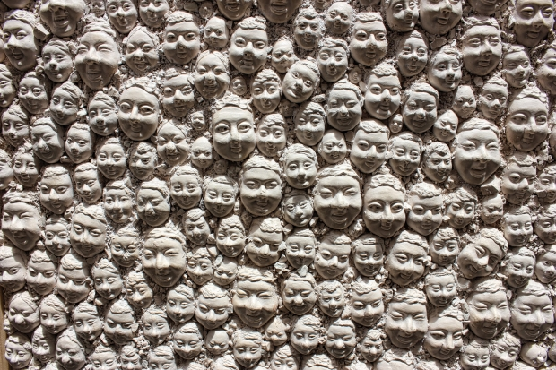

# Assignment 1
## Name: Sayak Kundu
## Roll Number: 20161035

### Question - 1
#### X = 2

1. **Original**

**On expansion (Montage Mode)**

*Note: Image is too big to fit on screen; displaying at 67%*

2. **Original**

**On expansion (Montage Mode)**

3. **Original**

**On expansion (Montage Mode)**

#### X = 5

1. **Original**

**On expansion (Montage Mode)**

*Note: Image is too big to fit on screen; displaying at 67%*

2. **Original**

**On expansion (Montage Mode)**

3. **Original**

**On expansion (Montage Mode)**

#### Difference between Nearest neighbour interpolation and Bilinear interpolation

*Coloured*

*Black and White*

We can clearly see that the left image is more pixelated that the others in both the cases. The left uses **Nearest Neighbour Interpolation** for resizing whereas the right one uses **Bilinear Interpolation**.

Nearest Neighbour fairs equally or even better with images containing high number straight edges.

##### For example:

**Original**

**X = 5 (Montage Mode)**

**Comparison between Bilinear Interpolation and Nearest Neighbour Interpolation**

We see that both fair almost the same.

In Nearest Neighbour the pixel value of a pixel's nearest neighbour is copied to it. This may cause abrupt change in pixel values and thus give us pixelated images. This is good for pixelated art work.

##### For example: Transform a 3 X 3 matrix to 9 X 9 matrix using Nearest Neighbour

In Bilinear Interpolation we have some smoothness as it's somewhat based on your section formula. The pixel value of the nearest pixel will have more influence on it than the one farther away. But they both contribute to it.

##### For example: Transform a 3 X 3 matrix to 9 X 9 matrix using Bilinear Interpolation

Nearest Neighbour Interpolation is faster than Bilinear Interpolation.

We can use **Bicubic Interpolation** for a better image than Nearest Neighbour or Bilinear Interpolation. It is smoother that both. Basically it uses a cubic equation for finding the pixel values.

### Question - 2

The given filter is an embossing filter.

**M** causes embossing. It also shows clearer picture of background as compared to **M' (M Transpose)**. M' shows clearer edges for the Cameraman in foreground. The vertical lines are better captured by M' than by M.

**Convolution with M**

 **Convolution with M'**

 

**Comparison between M and M'**

### Question - 3

1. Part 1

   **output_height = (height + 2 * (F - 1))/Z + 1**

   **output_width = (width + 2 * (F - 1))/Z + 1**

   **output_depth = N**

2. Part 2

   **Number of additions = (F * F - 1) * output_width * output_height**

   **Number of multiplications = F * F * output_width * output_height**

### Question - 4

Record your own voice

### Question - 5

The **3 X 3 Filter** is :

| 0      | 0      | 0      |
| ------ |:------:| ------:|
| **1**  | **1**  | **1**  |
| **-1** | **-1** | **-1** |

It's an Line detecting filter.

**Output**

The filter and it's transpose are applied on blur.jpg

**Original**

**Convolution with filter**

**Convolution with transpose of filter**

**Adding blur1.jpg and blur2.jpg**

**3 more images**

**Original**

**Using filter and it's transpose and adding them up**

**Original**

**Using filter and it's transpose and adding them up**

**Original**

**Using filter and it's transpose and adding them up**

**M** detects the **horizontal edges** whereas **M'** detects **vertical edges**.

### Question - 6

Finding a sub image from a parent image by traversing and checking.

*Note: We are not allowed to use normxcorr2*

**Sub Image**

**Parent Image**

**Result**

### Question - 7
